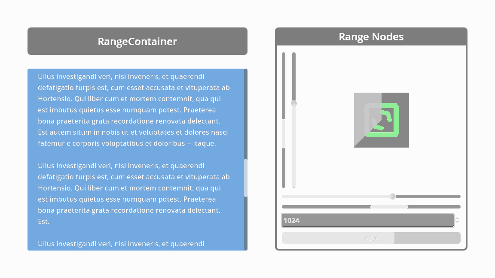

#  RangeContainer

A ScrollContainer that can be controlled by external Range nodes.

> [!NOTE]
> Once the add-on is enabled, its documentation can be accessed directly from the Godot IDE (``F1``).
