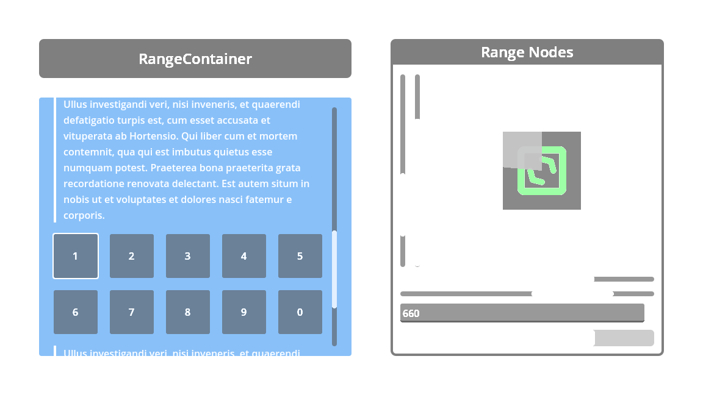

#  RangeContainer

A ScrollContainer that can be controlled by external Range nodes.

> [!TIP]
> This add-on has built-in documentation, usage instructions and references can be consulted directly in the Godot editor via the  **Search Help** (``F1``).
